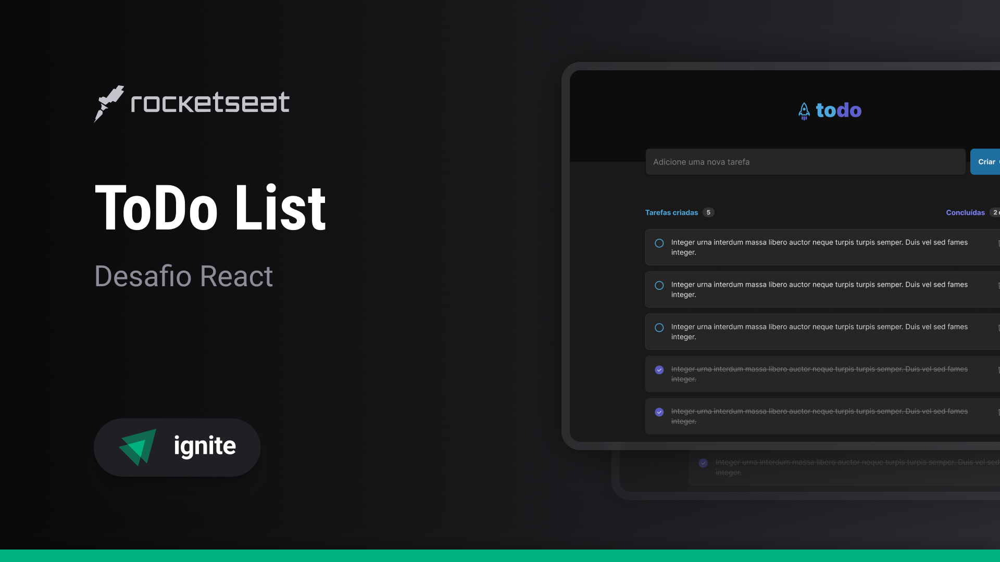

<p align="center">
  
  <h1 align="center">To Do List</h1>
</p>

<p align="center">Esta é uma aplicação de uma lista de tarefas</p>

<div align="center">
  
  
  
  
  
</div>



<p align="center">
 <a href="#funcionalidades" style="text-decoration: none">Funcionalidades</a> • 
 <a href="#instalação" style="text-decoration: none">Instalação</a> • 
 <a href="#tecnologias" style="text-decoration: none">Tecnologias</a> • 
 <a href="#contribuição" style="text-decoration: none">Contribuição</a> • 
 <a href="#autor" style="text-decoration: none">Autor</a>
</p>

<h3 align="center">🚀 Projeto Concluído 🚀</h3>

<h2 id="funcionalidades">✔️ Funcionalidades</h2>

- Criar tarefas
- Check de tarefa concluída
- Remover tarefa

<h2 id="instalação">💻 Instalação</h2>

Antes de começar, você vai precisar ter instalado em sua máquina as seguintes ferramentas:
[Git](https://git-scm.com), [Node.js](https://nodejs.org/en/). 
Além disto é bom ter um editor para trabalhar com o código como [VSCode](https://code.visualstudio.com/)

### 🎲 Rodando o Back End (servidor)

```bash
# Clone este repositório
$ git clone <https://github.com/PedroMolon/To-Do-List>

# Acesse a pasta do projeto no terminal/cmd
$ cd To-Do-List

# Instale as dependências
$ npm install

# Execute a aplicação em modo de desenvolvimento
$ npm run dev:server

# O servidor inciará na porta:3333 - acesse <http://localhost:3333>
```

<h2 id="tecnologias">🛠 Tecnologias</h2>

As seguintes ferramentas foram usadas na construção do projeto:

- [Node.js](https://nodejs.org/en/)
- [React](https://pt-br.reactjs.org/)
- [TypeScript](https://www.typescriptlang.org/)

<h2 id="contribuição">👋 Contribuição</h2>

Sinta-se à vontade para contribuir com melhorias no aplicativo. Basta fazer um fork do repositório, fazer as alterações e enviar um pull request.

<h1 id="autor">👨‍💻 Autor</h1>

<a href="https://github.com/PedroMolon">
  
  <h3>Feito com ❤️ por Pedro Molon 👋🏽 Entre em contato!</h3>
</a>
